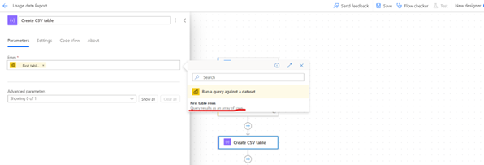

# Extracting Power Bi Report Usage Metric Data Using Power Automate

## Introduction

### Problem Statement
For Power BI report we usually get usage metric data from auto generated “Usage metric report”. But the limitation is that we can’t get information beyond 90 days as Microsoft automatically purge data after 90 days.

### Solution
One option is to create an automated process to save the data from the usage metric dataset into a storage like SharePoint/database on a scheduled basis. And then connect Power BI to the storage and build a custom report.

Below solution shows how we can achieve this using Power Automate and save data in SharePoint.

## Implementation

### Steps

1.Create a Usage Metric report in the workspace for which usage data is needed. Now this dataset will be the data source.

2.Open Power Automate Portal and create a scheduled flow.

3.Provide flow name, choose the schedule occurrence, and click on create.

4.Once you reach to below screen click “+” to add an action.

5.Search Power Bi and select “Run a query against a dataset”.

6.Select your workspace name and dataset from drop down. Add DAX query mentioned below. This will extract previous day’s data. Frequency can be changed according to need. If more information is needed, query can be altered to add more column using Power BI or DAX studio.

DEFINE
VAR __DS0FilterTable =
FILTER(
KEEPFILTERS(VALUES('Report views'[Date])),

'Report views'[Date] = TODAY()-1
)
VAR __DS0Core =
SUMMARIZECOLUMNS(
'Report views'[Date],
'Report views'[DatasetName],
'Reports'[ReportName],
'Report views'[UserId],
'Report views'[DistributionMethod],
__DS0FilterTable,
"Page_views", 'Model measures'[Page views],
"Report_viewers", 'Model measures'[Report viewers]
)

VAR __DS0PrimaryWindowed =
TOPN(
99999,
__DS0Core,
'Report views'[Date],
1,
'Report views'[DatasetName],
1,
'Reports'[ReportName],
1,
'Report views'[UserId],
1,
'Report views'[DistributionMethod],
1
)

EVALUATE
__DS0PrimaryWindowed

ORDER BY
'Report views'[Date],
'Report views'[DatasetName],
'Reports'[ReportName],
'Report views'[UserId],
'Report views'[DistributionMethod]

7.Add an action “Create CSV table” and select the following.

8.Next action will be saving the file in SharePoint location. Select an action “Create file” in SharePoint.

9.Add values in the parameters as below and save the flow. Timestamp need to be added in “File Name” so that at every run it creates a new file.

10.In SharePoint Directory files will be created like below and it can be accessed from Power BI for further reporting.

## Connection to Power BI

To build customized report, Power BI need to fetch data from SharePoint folder. For that follow the below steps.

* Open Power Bi desktop and from get data connect “SharePoint folder”.

* Once below screen pops up, provide the SharePoint folder URL, click “OK”. Click on “Transform Data” in next screen.

* Filter the data to get files only from the document library where usage data is getting stored.

* Expand the “Content” column, once below screen comes click “OK”.

* Now data is ready to build report on.

## Frequency of scheduling the Power Automate Flow

Frequency will depend on the usage of the report.

For example, if the report has good user base and used daily which need to be monitored, it should be scheduled daily. Otherwise, weekly or monthly is also fine if report is not being used that frequently.
